# Modu Desktop 原型设计

- 日期：2026-08-28
- 状态：Worktree Group 管理、上下文菜单与删除流程已确认，并已同步至 Figma `04 Screens` 页面与本地原型
- 范围：v0.1 客户端原型，不包含逐行 diff、完整 Git GUI 或多工作区
- Figma 原生设计：[Modu Desktop / 04 Screens](https://www.figma.com/design/eK0CqTm1y4jk6thzqBdUV5/Modu-Desktop?node-id=16-6)
- 字体：Figma 原型主体使用 Inter，Git Browser Detail 文件树沿用 SF Pro typography token；SwiftUI 客户端仍必须使用 PingFang HK

## 1. 设计方向

Modu Desktop 采用克制、紧凑、工作导向的 macOS 原生界面。原型以系统窗口、列表、sheet、popover、menu 和分裂按钮为主要构件，不使用营销式首屏、装饰插画、渐变背景或卡片式仪表盘。Git Browser Detail 使用少量功能卡片划分摘要、变更和提交，它们是连续工作区中的信息分组，不扩展为仪表盘。Figma 设计仅覆盖浅色主题，暂不包含暗黑主题。

界面的首要任务是让用户在 5–20 个主仓库、约 5 个活跃需求组和最多约 30 个 linked worktree 中快速定位当前目录，并立即交给 Agent、Git GUI、编辑器或终端。

本文定义交互与状态规则，`PRD.md` 定义业务和安全规则，仓库根目录的 `design/prototypes/` 图片只展示代表性视觉状态。图片中未出现的空、错误、取消和部分失败状态仍必须按本文实现；图片与文字冲突时先修正二者，不能以图片中的偶然细节替代规则。

## 2. 主窗口结构

### 2.1 标题栏

- 标题栏高度固定为 36px，不随页面状态、任务状态或标题内容增高。
- 标题栏不显示 `Modu`。
- 正常状态居中显示当前工作区目录名，例如 `platform-workspace`；手动 Fetch/Pull 运行时，同一 workspace-title 区域替换为 spinner 和 `Fetch 'origin'` 或 `Pull 'origin'`。
- 手动 Fetch/Pull 全部成功后，workspace-title 显示 `Already up to date` 3 秒，再恢复工作区目录名；不叠加成功图标、toast 或第二处提示。
- workspace-title 区域在正常与暂态下都保留同一点击命中区和 hover 反馈，点击后重新选择工作区。有批量任务运行时先请求取消；原子写入或目录迁移完成前保持当前工作区和明确的 switching 状态，禁止旧任务结果写入新工作区。
- 名称右侧不显示三角、箭头或 disclosure 图标。
- 尚未选择工作区时，标题栏中部保持空白。

### 2.2 左侧栏

左侧栏默认宽度为 320px，可调整，只包含两个分区：

- `Repositories`
- `Worktrees`

除首次启动外，所有主窗口状态都以 Figma `Window Shell` 组件实例为根；状态画板不得复制、detach 或重新绘制标题栏与侧栏。画板只通过实例覆盖表达工作区名称、当前选中行和行状态，并在 shell 的 content 区叠加详情、空状态、sheet、menu、toast 或进度内容。

两个分区标题左侧都依次显示 chevron 和 open/closed folder。展开时 chevron 向下、folder 使用橙色 open 状态；折叠时 chevron 向右、folder 使用蓝色 closed 状态。chevron、folder 和标题共同属于整行折叠命中区；`Repositories` 右侧操作组不触发折叠。键盘焦点落在分区标题时，`Left/Right` 折叠或展开，`Return` 切换状态；VoiceOver label 和 value 必须包含分区名及 Expanded/Collapsed 状态。

`Repositories` 标题右侧固定显示三个 SVG 图标按钮：

- Add：添加主仓库。
- Fetch：对全部主仓库执行 Fetch。
- Pull：对符合安全条件的主仓库执行 Pull。

三个图形分别使用 plus、clockwise refresh 和 down-to-line 的简洁轮廓 SVG，图形为 16px，命中框固定为 24px，不显示按钮边框或背景，浅色外观默认使用 `#4D4D4D`。图标按钮在 hover 时显示 tooltip，并分别提供 `Add Repository`、`Fetch All Repositories`、`Pull Eligible Repositories` accessibility label。没有主仓库时 Fetch/Pull 禁用；配置错误或待切换工作区时按受影响范围禁用。任一 Repositories 异步操作运行时三个按钮保持尺寸和位置并统一采用系统 disabled 置灰状态，不接受点击。手动 Fetch/Pull 的 loading 与完成反馈只在 workspace-title 表达，不在按钮、仓库行或内容区重复显示。

`Worktrees` 标题右侧固定显示一个无边框 plus 图标按钮，图形 16px、命中框 24px，tooltip 和 accessibility label 均为 `Create Worktree Group`。点击按钮只打开创建 sheet，不触发分区折叠。没有主仓库、`.modu-worktrees.yaml` 无效、工作区正在切换或已有 Group 变更操作进行中时禁用，并保持原尺寸和位置。

### 2.3 仓库节点

- 主工作树和 linked worktree 使用固定蓝色的仓库/工作树图标；同一图标规则覆盖 Default、Selected、dirty 和同步状态。
- 图标不支持自定义颜色，不提供独立点击动作；点击整行选择节点。
- 主仓库右键菜单固定为 `Copy Path`、`Reveal in Finder`、`Delete Repository`；linked worktree 右键菜单为 `Copy Path`、`Reveal in Finder`、`Delete Linked Worktree…`。Group 与主仓库菜单文案不带省略号，右侧详情不重复提供 Reveal 按钮，也不在行内显示删除按钮。
- 主仓库、group 和 linked worktree 行高统一为 32px，图标、文字、选择背景和行尾状态都不得改变行高。
- 主工作树或 linked worktree 存在 staged、unstaged 或 untracked 变化时，最右侧固定变化槽位显示直径 6px、颜色 `#AAAAAA` 的圆点；ignored content 不触发圆点，group 不聚合子项圆点。Fetch/Pull 不在节点行增加同步状态或 spinner。
- 圆点只是视觉提示；对应行的 tooltip 和 accessibility value 必须明确给出 `Working tree has changes`，不能只用颜色、圆点或 spinner 让用户猜测。

### 2.4 Group 节点

- group 左侧依次显示 chevron 和 open/closed folder；展开时 chevron 向下且 folder 为橙色 open 状态，折叠时 chevron 向右且 folder 为蓝色 closed 状态。
- chevron、folder 与标题共同构成整行折叠命中区，点击任意非右键菜单区域都切换展开/折叠；不支持自定义颜色。
- group 下的 linked worktree 保持一级缩进。
- group 右键菜单固定为 `Copy Path`、`Reveal in Finder`、`Edit Worktree Group`、`Delete Worktree Group`，均不带省略号；无论 `document` 是否存在或有效，菜单都不显示 Open Plan、Reveal Plan in Finder 或其他方案文档操作。路径操作和编辑/删除操作之间使用原生分隔线。
- `Copy Path` 复制规范化绝对路径，只在路径存在、位于受管边界内且没有符号链接逃逸时显示；路径异常时从菜单隐藏。`Reveal in Finder` 无法执行时保留但禁用，并提供具体原因。
- group 行可获得键盘焦点；`Left/Right` 折叠或展开，`Return` 执行相同切换。
- 主仓库、linked worktree 和 group 的全部右键菜单命令同步到随当前选择更新的应用主菜单，并复用相同的可用状态和禁用原因；纯键盘用户可从菜单栏触发，VoiceOver 用户还可通过 Actions 访问。危险命令仍进入同一确认流程。

### 2.5 右侧内容

未选择节点时，右侧正常状态只显示居中的静态图标和 `What should we build?`。不显示工作区概览标题、仓库或 group 列表、统计、Add Repository 主操作、Agent、Git GUI、编辑器或终端分裂按钮；空工作区使用相同静态内容，添加入口统一位于侧栏 Repositories 标题。阻断性配置错误和必须处理的安全流程可覆盖静态内容。选中主仓库或 linked worktree 后才显示全部适用于该目录的外部工具分裂按钮和目录详情。

未选择状态必须始终可返回：应用的 View 菜单提供 `Clear Selection`，清除当前仓库或 linked worktree 选择但不切换工作区，也不改变 group 展开状态和侧栏滚动位置。主窗口内没有 sheet、popover、menu 或确认窗口时，`Escape` 执行同一命令；存在临时界面时仍优先关闭该界面，不得顺带清除节点选择。返回后焦点落到静态内容区域，并通过 VoiceOver 宣布 `No Repository or Worktree Selected`。

四类分裂按钮依次为：

1. Agent：Codex、Claude Code。
2. Git GUI：Fork。
3. 编辑器：VS Code、Cursor。
4. 终端：Warp、Terminal。

分裂按钮主要区域显示当前类别全局默认目标的图标和名称；点击后直接使用该软件打开当前选中的主工作树或 linked worktree 路径。右侧 chevron 是独立命中区，点击只打开目标菜单，不同时触发主要区域命令。

目标菜单只包含检测成功且适用于当前路径的目标，不显示 check 图标、选中态或其他持久默认标记；默认值只通过分裂按钮主要区域表达。菜单项默认透明，鼠标 hover 时使用 `#F5F5F5` 浅灰背景；键盘焦点沿用原生菜单焦点反馈，但不转化为选中态。点击菜单项后立即尝试用该软件打开当前路径，只有启动成功后才更新默认目标；失败时保留原默认值并显示非模态错误。

应用私有数据中只维护一份外部工具全局偏好配置，其中分别保存 Agent、Git GUI、编辑器和终端四个类别的默认目标；不按工作区、仓库或 worktree 分别保存。当前默认目标未检测到或不适用于当前目录时，主要区域临时回退到该类别第一个可用内置目标；只有回退目标成功打开目录后才写回对应类别。未检测到任何适用目标的类别不显示按钮。

启动前路径复核失败、Automation 权限被拒绝或目标应用启动失败时，错误紧邻外部工具操作区显示，明确失败目标和经过凭据清理的简短原因，并提供 Copy Details。错误保持到用户关闭、再次尝试或上下文改变；相同目标和相同原因在状态改变前不重复堆叠，只通过 accessibility announcement 宣布一次，且不移动当前键盘焦点。

### 2.6 Git Browser 摘要

选中主工作树或 linked worktree 后，工具区下方的 `Worktrees` 摘要卡固定显示：

- `Path`：首行显示当前工作树相对工作区根目录的路径。主工作树使用 `repositories/<repo-name>`，linked worktree 使用 `worktrees/<group>/<repo-name>`。
- `Base`：默认分支。
- `Branch`：当前分支；detached HEAD 显示 `Detached at <short-sha>`，不伪造分支名。
- `Status`：当前分支相对 Base 的文件变化统计。

Path 是只读定位信息，不显示 `Path` 标签，也不是独立操作入口。路径使用规范化仓库身份和 group 身份派生，不使用展示名，不显示工作区绝对路径；空间不足时中部截断，hover tooltip 和 accessibility value 提供完整相对路径。Figma `Git Browser Detail` 的每个实例必须显式覆盖 `path` property，禁止依赖组件默认值，以免不同画板错误继承主工作树示例。

Status 只显示状态图标和数字，不显示 Added、Moved、Modified、Deleted 文字。图标使用状态色；数字只有在与当前背景达到 4.5:1 对比度时才可使用同色，否则回退到系统主文字色：

- Added：绿色。
- Moved：紫色 `#B262ED`。
- Modified：橙色。
- Deleted：红色。

颜色始终与不同图标形状和数字同时出现，不把颜色作为唯一状态信号。Moved 图标在浅色原型中使用 `#B262ED`；深色外观使用对比度合格的浅色变体。

`A/C/untracked → Added`、`R → Moved`、`M/T → Modified`、`D → Deleted` 是全产品唯一映射，详情头和 Changes 文件区不得出现第五种无定义图标。Git 返回冲突或无法映射的状态时不计入任一四类，也不伪装成零变化；对应位置显示中性的 `Unknown` 占位并提供明确 accessibility label，同时记录诊断，不借用任一状态图标或颜色。四个 Status 计数组合为一个可访问元素，accessibility value 读作例如 “3 added, 1 moved, 2 modified, 1 deleted”；视觉 tooltip 可补足省略的文字标签。

默认分支无法安全解析或对应 Base ref 不存在时，`Base` 显示 `Unknown`；缺少可用 Base 或 Git diff 读取失败时，`Status` 以中性 `Unavailable` 占位替代四个零计数。详情区同时显示具体原因：可重试的读取错误提供 Retry，需用户修正配置的异常提供 Open Config 或 Copy Details；占位和原因建立可访问关系，不把失败状态只藏在 tooltip 中。

## 3. Git Browser Detail

选中主工作树或 linked worktree 时复用同一页面骨架：

1. 顶部为外部工具操作区。
2. `Worktrees` 摘要卡首行显示当前工作树的工作区相对路径，再显示 Base / Branch / Status。
3. 当前工作树非 clean 时显示展开的 `Changes` 卡；clean 时不保留该卡。
4. 存在可展示提交时显示 `Commits` 卡。主工作树显示当前分支历史，linked worktree 显示当前分支相对默认分支的独有提交。

切换主工作树或 linked worktree 时，Path 与摘要信息立即切换到新选择，Changes 与提交列表进入绑定新选择的稳定 loading 状态并取消旧请求；旧路径和旧内容不得继续显示在新选择下，迟到结果必须丢弃。HEAD / Base 变化只重载依赖它们的 Status 与提交列表，工作树文件事件只重载 Changes。loading 提供明确 accessibility label，因导航触发的自动取消不显示为错误，也不移动当前焦点。

Changes 与提交列表是两个有明确名称的键盘与 VoiceOver 区域。Changes 使用 `Up/Down` 移动平铺文件行焦点；每个文件行的 accessibility value 读出 staged/unstaged 状态和仓库相对路径，Moved 同时读出新旧路径。提交列表使用 `Up/Down` 移动行焦点，不存在选择提交后刷新文件树的联动。Load More 追加结果后保持触发控件的焦点并宣布新增条数，不把焦点重置到列表顶部。

Changes 文件行和 Commits 提交行统一使用固定 28px 行高。键盘焦点、hover、状态图标、长文本或 loading 不得改变行高；超出空间的完整内容通过 tooltip 和 accessibility value 提供。

Changes 规则：

- 计数包含 staged、unstaged 和 untracked 的不同路径，同一路径只计一次；ignored 文件不计入。
- 默认展开；工作树 clean 时整个区域隐藏，不显示 `Changes 0`。
- 每行显示完整仓库相对路径；空间不足时中部截断，hover 和 accessibility value 提供完整路径。
- 状态通过文件名前的图标和颜色表达。
- Moved 使用 `#B262ED`。
- Moved 在同一 28px 行内显示新路径，并用次级文本显示 `from <old-path>`；空间不足时截断，复制路径和 Reveal 操作使用新路径。
- 最右侧不重复显示状态 label 文字。
- Changes 读取失败时保留区域并显示 `Unavailable`、原因和 Retry，不能按 clean 隐藏。

提交列表规则：

- `Commits` 卡只显示通用标题，不显示 `Commits unique from <base>`、提交总数、HEAD 或分支 badge。主工作树与 linked worktree 的数据范围差异不增加额外说明行。
- 每个提交固定为一行 28px，依次显示提交信息、提交人、提交时间和短哈希；四列在可用宽度内稳定对齐，提交信息优先获得剩余空间。
- 长内容保持单行并使用尾部截断，hover 显示完整内容；每行 accessibility value 按相同顺序读出四项完整值。
- 没有可展示提交时隐藏整个 `Commits` 卡，不显示零提交空状态。
- linked worktree 的 Base ref 缺失、Git 读取失败或仓库处于未完成 merge/rebase 时显示原因、Retry 和可用的外部工具入口，不能伪装成没有提交；主工作树当前分支历史读取失败使用相同错误框架，但不依赖 Base。Changes 不受该错误冻结。
- 首批提交最多显示 100 条；存在更多时使用 Load More，不让长历史撑开窗口或阻塞首次渲染。
- v0.1 不显示单个提交的文件树，也不实现逐行 diff。

## 4. 反馈与异常

### 4.1 Loading

- Repositories 操作组触发 Add、Fetch 或 Pull 后，三个全局按钮统一置灰禁用并保持原尺寸；按钮区域不显示 spinner。
- 手动 Fetch/Pull 只在 workspace-title 显示 spinner 和 `Fetch/Pull 'origin'`。主仓库行、linked worktree 行和右侧内容区都不显示同步状态、进度条、完成数或 Stop。
- 操作结束前不弹出结果窗口。
- Add Repository 提交后 sheet 切换为稳定的 clone 进度并提供 Cancel；失败或取消保留仓库声明和 Retry，但不能在最终路径留下半成品目录。

### 4.2 结果反馈

- 手动 Fetch/Pull 全部仓库成功：workspace-title 显示 `Already up to date` 3 秒，通过 accessibility announcement 宣布结果，然后恢复工作区目录名；不显示成功 toast。
- 手动 Fetch/Pull 存在 skipped 或 failed：先恢复工作区目录名，再显示一次结果汇总弹窗，按主仓库列出成功、跳过和失败原因。
- 自动 Fetch 成功保持静默，不使用手动标题栏暂态；失败不弹窗，只更新可关联的非模态异常状态，同一原因在状态改变前不重复打扰。
- 汇总明确说明 linked worktree 未被修改。
- 不自动 checkout、merge 或 rebase，不在结果弹窗中暗示这些行为。

结果汇总弹窗使用本次操作完成时的稳定结果快照：标题明确是 Fetch 或 Pull，顶部以一个可访问摘要读出成功、跳过和失败数量，并说明 linked worktree 未被修改；下方结果列表保持 `.modu.yaml` 顺序，不因状态或滚动位置重排。结果列表只读，行不提供选中、聚焦或按下态，也不响应 `Up/Down` 切换；每一行仍作为单一可访问元素依次读出仓库展示名、结果状态和原因。弹窗打开时通过 accessibility announcement 宣布汇总，键盘焦点落到唯一的 `Done` 按钮；底部不显示 Copy Details、Review Repository 或其他行级操作。点击 `Done`、按 `Return` 或按 `Escape` 关闭弹窗，随后焦点恢复到触发本次操作的 Fetch 或 Pull 按钮；若该按钮因上下文变化已不存在，则恢复到 Repositories 分区标题。

### 4.3 配置错误

- `.modu.yaml` 无法加载或解析时，最后一次有效状态仅保留在内存中，错误解除前隐藏整个侧栏；标题栏保持显示，阻断恢复页占满标题栏下方的窗口主体，不渲染任何仓库、group 或 linked worktree 行。
- Add、Fetch、Pull 暂停且不可触发；恢复页不重复显示已隐藏的 Repositories 操作控件。
- 阻断恢复页显示文件路径、错误行号和可操作的错误原因。
- 提供 Open Config、Reveal in Finder 和 Reload，不内置 YAML 编辑器；无法定位行号时省略行号，不显示虚假值。
- 错误期间不执行 clone、remote 更新或仓库 cleanup。
- `.modu-worktrees.yaml` 错误使用独立错误页：主仓库 Add/Fetch/Pull 和 additive 对账保持可用，最后一次有效 worktree 列表标记为 Stale，worktree 创建、删除、repair 和依赖关联 worktree 的 repository cleanup 禁用并说明原因。
- 配置文件缺失、版本过高和 schema 错误都使用同一恢复框架，但标题、原因和可用操作必须具体。

### 4.4 危险操作

Edit Worktree Group 中取消勾选已有仓库并点击 `Save Changes`，即授权本次移除对应 linked worktree 和本地分支，不再展示第二个风险确认页。列表只显示 `Clean`、`Dirty`、`Unknown`、`Not Created` 四种 Working Tree 状态；Dirty 和 Unknown 都允许取消勾选并保存，Clean 不暗示没有 ignored content 或 local-only commit。存在 removal 时 `Save Changes` 使用 destructive 样式。执行前若锁内 working tree 状态与列表不同，只中止并刷新受影响 removal，其他项继续。

删除单个 linked worktree 的确认窗口必须显示：

- 仓库名。
- worktree 路径。
- 本地分支。
- dirty 状态。
- ignored content 状态：`None`、`Present` 或 `Unknown — could not verify`；`Present` 时可展开查看受影响路径摘要，不能因 dirty 为 clean 而隐藏。
- 可检测到的未推送提交风险；风险同时覆盖当前 HEAD 和记录分支，detached HEAD 显示 `Detached at <short-sha>`；无法读取时显示 `Unknown — could not verify`，不显示为 0。
- 远端分支不会删除的说明。
- destructive 确认按钮使用 `Delete Worktree & Local Branch`，完整表达目录与本地分支都会被删除；不能只写 `Delete Worktree`。

删除 group 的确认窗口标题固定为 `Delete Worktree Group?`，不显示 group 名称；窗口必须逐项列出全部相关 worktree、本地分支、ignored content 和其他风险。无论 dirty 与否都展示二次确认；确认按钮使用 `Delete <N> Worktrees & Local Branches` 并采用 destructive 样式，不能省略本地分支删除范围。

`Delete Repository` 使用独立的 `Delete Repository?` 确认页，逐项列出主仓库名称和受管路径、关联 linked worktree 及本地分支、主工作树和关联 worktree 的 dirty / ignored content / local-only commit 风险，以及将执行的配置更新、强制移除、本地分支删除和主仓库 Trash 移动。页面明确远端仓库与远端分支不会删除。没有关联项时确认按钮为 `Delete Repository`；存在关联项时为 `Delete Repository & <N> Worktrees`。手工修改 `.modu.yaml` 产生的仓库 cleanup 复用相同 Review Cleanup 信息结构。仅编辑配置文件不会自动打开确认或执行删除。

确认后先在操作锁内重新计算当前风险；路径、Git 注册、分支、dirty、ignored content 清单或未推送风险变化时不执行删除，原确认页就地更新并要求再次确认。删除执行期间确认窗口切换为稳定进度状态，禁止重复提交。存在部分失败时显示逐项结果和 Retry Failed；成功项保持完成，失败项及其配置记录保留。若 worktree 目录已成功移除但本地分支删除失败，重试确认页把目录步骤标为已完成，并重新展示当前分支风险后从分支删除继续。全部成功后关闭弹窗，并将选择与键盘焦点移到被删除项原位置之后的相邻可见安全节点；没有后继节点时移到前一相邻可见安全节点，均不存在时才回到未选择状态。不得保留已删除节点为选择项，也不得无条件清除仍有效的选择。

### 4.5 创建 Worktree Group

点击 Worktrees 标题右侧 plus 打开 `Create Worktree Group` sheet。正文自上而下只包含可编辑的 `Group Name`、`Repositories` 标签、仓库 checkbox 列表，以及 `Cancel` / `Create Group`。不显示已选择数量、Group 路径、分支预览或编辑、`document`、帮助文案或派生值摘要。

Group Name 原样保存并在输入框处就地校验合法单段目录名、安全 Git ref、前导 `-` 和规范化身份碰撞；不自动 slug 化。仓库列表沿用 `.modu.yaml` 顺序，每行固定 32px，依次显示 checkbox、固定蓝色仓库图标、展示名和右侧次级内部身份。没有勾选仓库时只禁用 `Create Group`，不显示错误或选择数量。提交后 sheet 原位进入逐仓库进度；成功项保留，失败项提供 `Retry Failed`。全部完成后展开并聚焦新 Group 行。

### 4.6 编辑 Worktree Group

`Edit Worktree Group` sheet 复用创建 sheet 的尺寸与列表密度。Group Name 可选择和复制但不可编辑，并以 accessibility value 表达 read only。仓库列表增加 `Working Tree` 列，每项以图标、文字和可访问值表达 `Clean`、`Dirty`、`Unknown` 或 `Not Created`，不只依赖颜色。

没有成员变化时禁用 `Save Changes`；取消全部勾选时也只禁用提交，不显示提示。只有 additions 时使用普通主操作样式，存在 removals 时保持 `Save Changes` 文案并使用 destructive 样式。点击后原位显示逐仓库进度，直接执行新增或移除，不增加风险页；成功项保留，失败项提供 `Retry Failed`。状态变化导致某项移除中止时刷新该行，保持 sheet 可继续提交。

## 5. 状态原型

### 5.1 首次启动

先安装 `modu-cli`，成功后再允许选择工作区。流程直接呈现为两个设置步骤，不展示产品营销信息。

两个设置步骤的图标使用相同的 48px 稳定槽位，并按实际可见轮廓统一视觉大小和居中位置，不能只统一图标外框尺寸。

CLI 安装失败或安装目标冲突时停留在第一步，就地显示简短原因、Retry 和错误详情，不允许带着失败状态继续选择工作区。没有可安全写入的现有 PATH 目录而改用 `~/.local/bin` 时，安装成功后先显示一次性 PATH 配置说明，再进入工作区选择；应用不代改 shell 配置。首次设置不显示 `Not Now` 或其他跳过入口，安装成功并完成工作区选择与检查前都不能进入主窗口。

选定工作区目录后，第二步原位进入 `Checking Workspace…`，完成无副作用检查前不进入主窗口。不包含任何 Modu 配置和受管目录的可写目录，或配置完整有效的已有工作区，通过检查后才初始化或载入；仅存在一份配置、任一配置无效，或配置缺失但受管目录或 skill 目标已有内容时，停留在第二步，显示所选路径和具体冲突，并提供 `Choose Another Folder` 与运行 Doctor 的明确指引。阻断状态不得创建或补写配置、受管目录和 skill 链接；检查中与阻断结果均通过 accessibility announcement 传达且不抢走当前焦点。

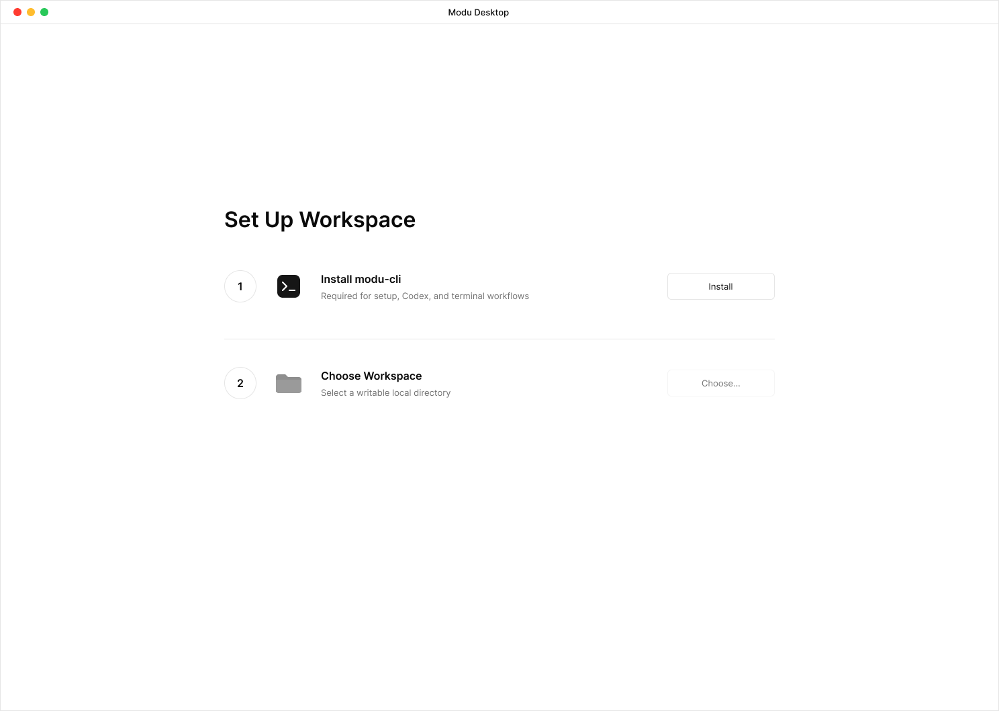

### 5.2 未选择状态

没有节点被选中时，右侧内容区不再提供工作区概览。正常状态仅显示一个 56px 的中性灰色线性 Agent/Terminal 图标，并在下方显示 `What should we build?`；组合在右侧内容区水平居中、略高于垂直中点。标题使用约 32px 的常规或中等字重，不使用 hero 字号，也不放入卡片或其他容器。

静态内容不显示仓库状态、活跃 group、计数、时间、成功信息、Add Repository 主操作或其他说明。侧栏保持完整并且没有选中行；用户通过侧栏完成定位或点击 Repositories 标题的 Add 图标进入添加流程。

静态组合是单一可访问区域，accessibility label 为 `No Repository or Worktree Selected`，value 读出 `What should we build?`。阻断性配置错误、待确认 repository cleanup 或 cleanup 部分失败可替换静态内容并沿用各自既有恢复流程；手动 Fetch/Pull 暂态只替换 workspace-title，不恢复概览列表或在侧栏增加同步状态。

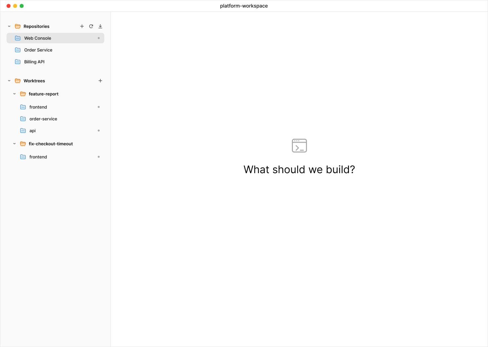

### 5.3 配置错误

该原型展示 `.modu.yaml` 错误：最后有效状态仅保留在内存中，侧栏隐藏，阻断恢复页占满标题栏下方的窗口主体；仓库派生操作冻结，并提供 Open Config、定位文件和重新加载入口。`.modu-worktrees.yaml` 错误只冻结 worktree 及依赖其记录的 cleanup 操作，仍显示明确标记为 Stale 的最后有效 worktree 列表，不能复用该全宽阻断状态。

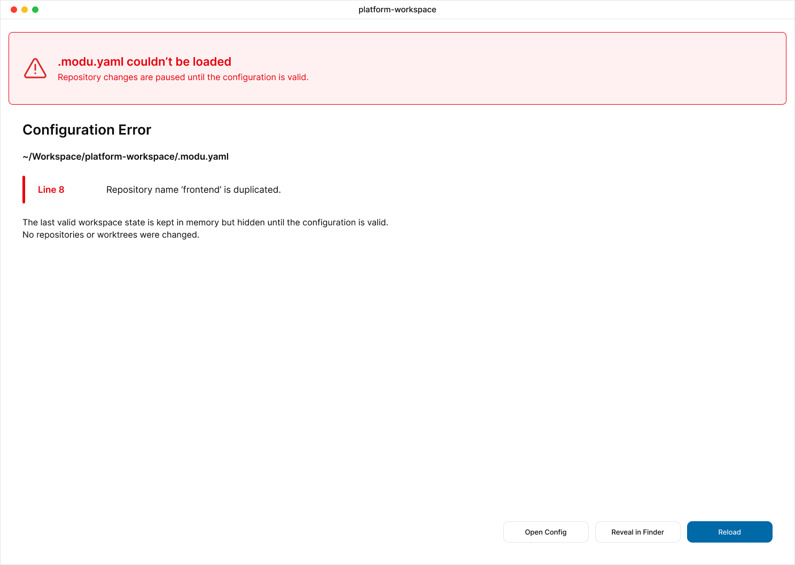

### 5.4 添加仓库

sheet 正文只包含 `Repository URL`、`Display Name (Optional)` 两个标签和对应输入框，不显示帮助文案、仓库名、目标目录、路径预览或默认分支说明。仓库名和目标目录仍从 URL 内部派生，默认分支仍在 clone 后从 origin 解析。不同远端的同名仓库在 v0.1 中不受支持，重复身份必须在 URL 字段就地提示，且不能暗示修改展示名可以解决；凭据 URL、非法仓库名和目录冲突同样在提交前就地提示。无法保留 `.modu.yaml` 未改动内容时不写入并提供 Open Config；提交后 clone 失败保留声明并提供 Retry。

URL 本地派生出的仓库名和目标路径不在 sheet 中展示。派生仍用于提交前校验；相关错误统一关联回 URL 字段，不新增第三个只读信息区。

sheet 打开时键盘焦点落在 URL。用户提交且验证失败时保持 sheet 打开，将焦点移到第一个无效字段；仓库身份或目标目录等由 URL 派生的错误关联回 URL 字段。每条行内错误都与对应字段建立可访问关系，并在首次出现或内容变化时通过 accessibility announcement 宣布一次；更正输入后只清除已经解决的错误，不重复播报未变化的问题。无法安全写回配置属于表单级错误，焦点移到错误摘要，Open Config 保持在同一键盘顺序中。

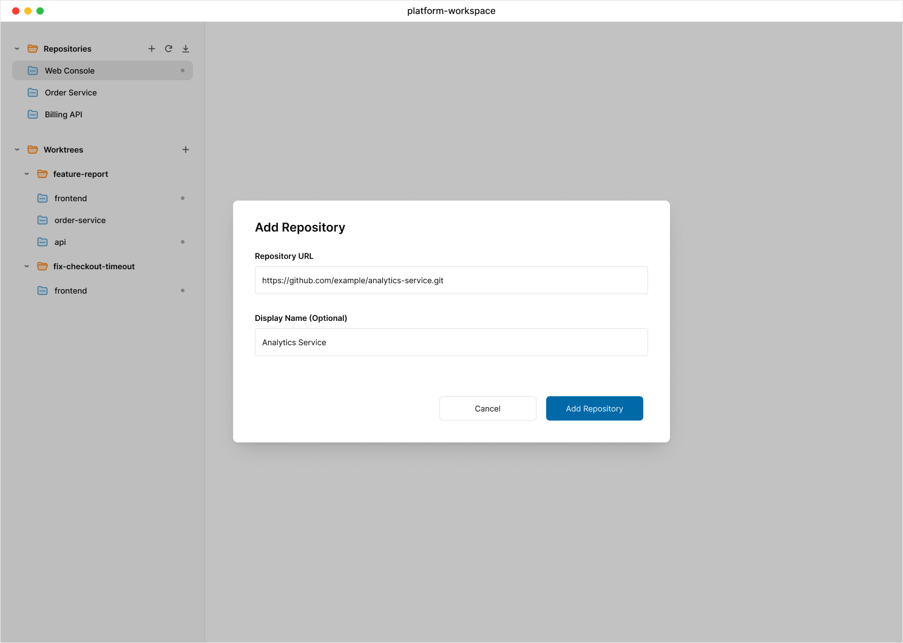

### 5.5 删除 Repository

独立确认页展示主仓库、关联 worktree、风险与执行顺序；示例包含关联项，确认按钮显示 `Delete Repository & <N> Worktrees`。

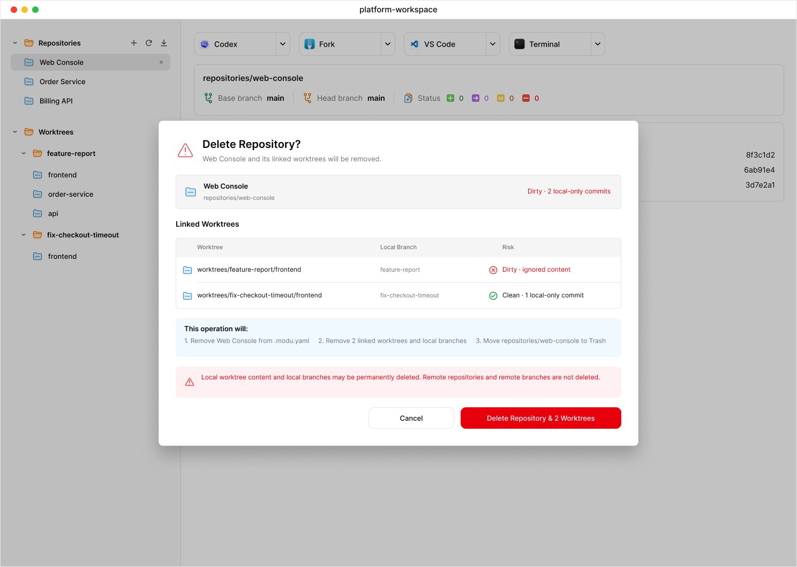

### 5.6 主仓库详情

选中主工作树时显示工具操作区，以及与 linked worktree 相同的 Worktrees / Changes / Commits 卡片骨架。摘要卡 Path 为 `repositories/web-console`；该示例工作树 clean，因此不显示 Changes；Commits 显示当前 `main` 分支历史。右侧不提供 Reveal in Finder 按钮。

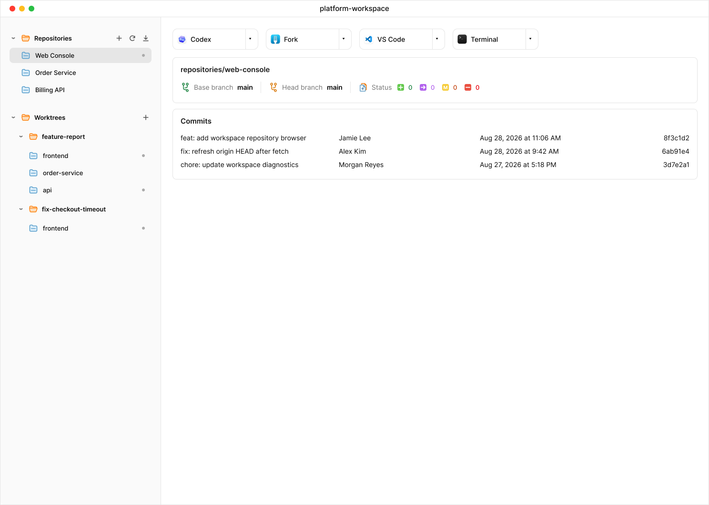

### 5.7 Fetch Running

Repositories 三个操作按钮统一置灰禁用，按钮和 32px 列表行尺寸保持稳定；workspace-title 替换为 spinner 与 `Fetch 'origin'`。侧栏行和内容区不显示同步状态、进度或 Stop。

### 5.8 全部成功暂态

全部成功时 workspace-title 显示 `Already up to date` 3 秒，不显示 toast，随后恢复工作区目录名。

### 5.9 Pull 部分跳过或失败

存在 skipped 或 failed 项时，workspace-title 先恢复工作区目录名，再使用单次汇总弹窗，并明确 linked worktree 不受影响。结果列表只读且不显示选中态，底部只保留 `Done` 关闭按钮；弹窗后的主窗口仍使用与主工作树一致的卡片详情。

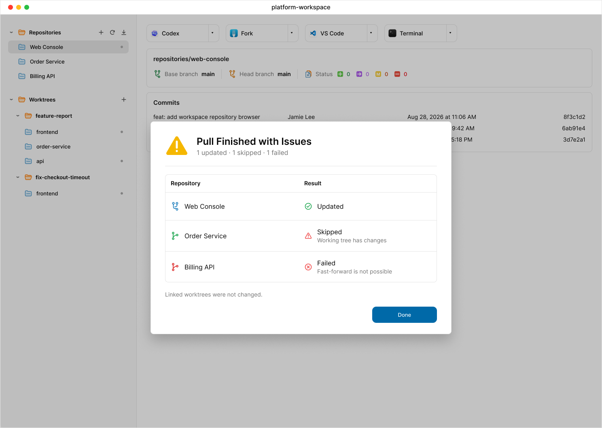

### 5.10 创建 Worktree Group

sheet 使用紧凑原生表单和 32px 仓库行；空选择只表现为禁用 `Create Group`，列表下方不显示选择数量。

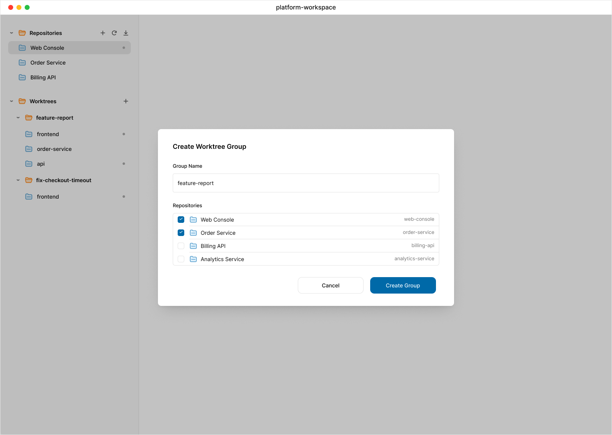

### 5.11 编辑 Worktree Group

Group Name 只读，列表展示 Working Tree 状态列；示例同时覆盖 Dirty、Unknown、Clean 和 Not Created，并展示存在 removal 时的 destructive `Save Changes`。

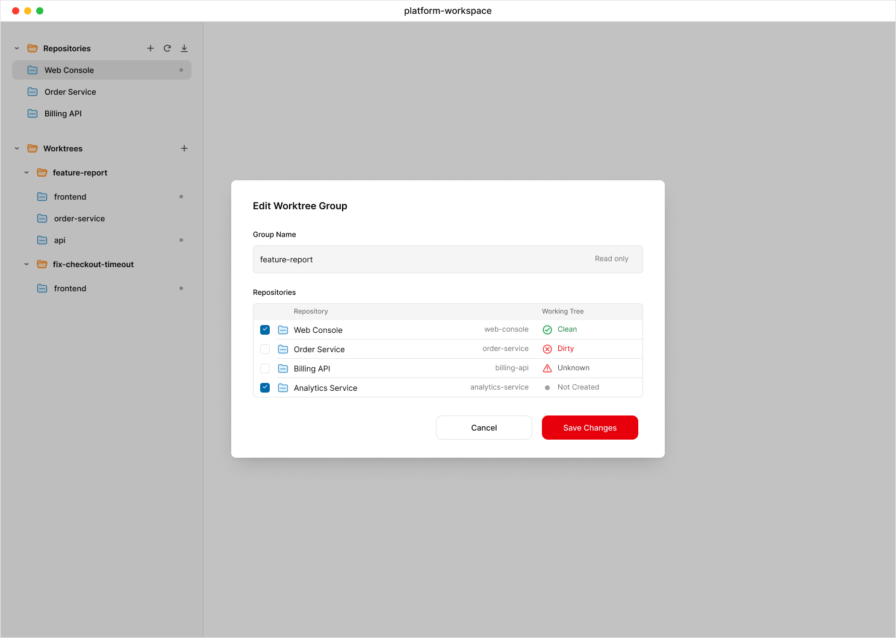

### 5.12 删除 Worktree Group

弹窗逐项列出即将删除的 worktree、本地分支、dirty、ignored content 与 local-only commit 风险；clean 行仍明确 ignored content 和 local-only commits 的检测结果。

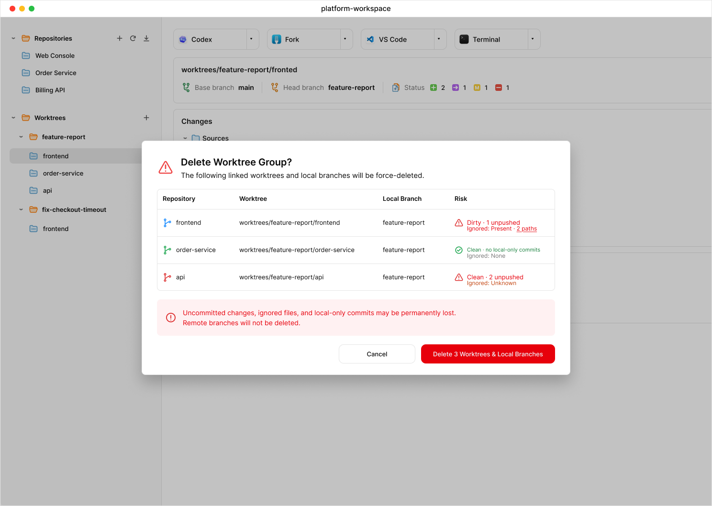

### 5.13 删除单个 Linked Worktree

弹窗明确 force-remove、本地分支删除、可能永久丢失的 dirty 与 ignored 本地内容，以及远端分支不受影响。

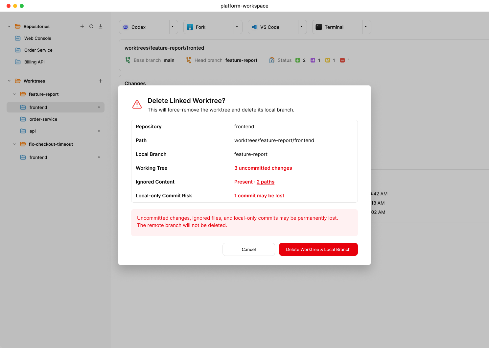

### 5.14 Linked Worktree Git 浏览

选中 linked worktree 时，使用与主工作树一致的卡片骨架；摘要卡 Path 为 `worktrees/feature-report/fronted`，Changes 显示非 clean 工作树文件，Commits 显示相对 Base 的独有提交。提交不显示范围说明或选择后文件树；原型数据中的短 SHA 必须只使用十六进制字符，文件状态严格使用四类映射，rename 同时表达新旧路径。

同一张代表性原型同时展示 Status 与 Changes 时，示例 Status 四类计数必须与可见 Changes 文件行逐项汇总一致，避免原型数据自相矛盾；这只约束原型数据一致性，不改变第 2.6 节中 Status 相对 Base、Changes 表示当前工作树的独立语义。

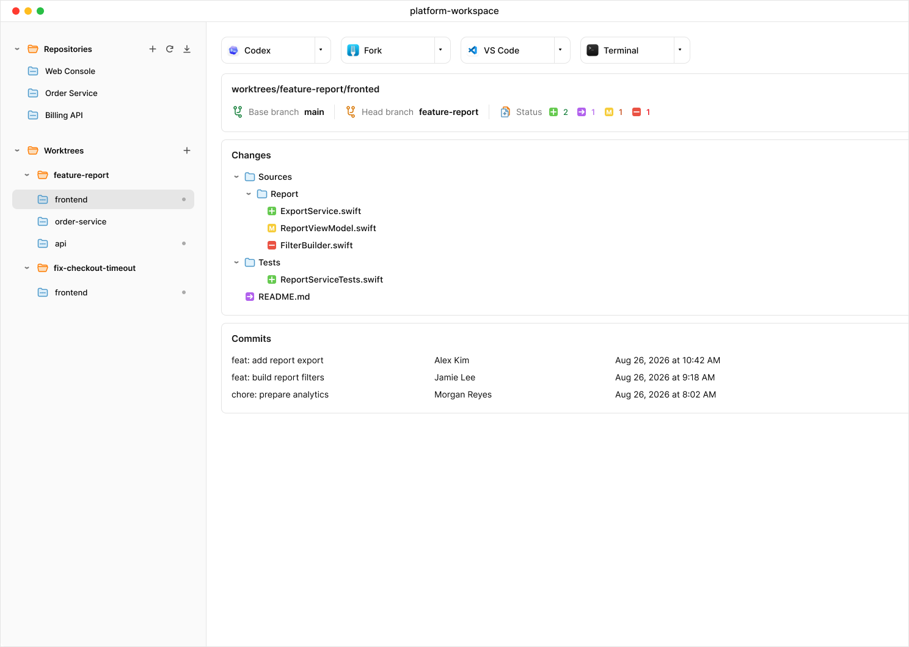

### 5.15 Agent 分裂按钮

该原型展示 Agent 分裂按钮的下拉菜单。Codex 行使用 `#F5F5F5` 浅灰背景表示 hover；菜单无 check 图标和选中态。点击 Codex 或 Claude Code 都会立即用对应软件打开当前工作树路径，成功后把该软件写入同一份全局偏好配置，作为 Agent 分裂按钮的新默认值。

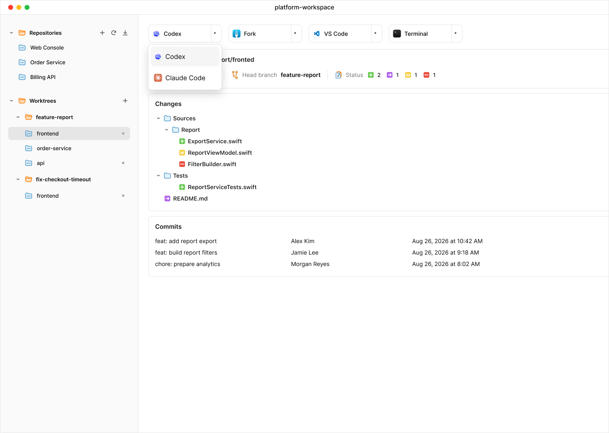

### 5.16 Linked Worktree 右键菜单

该画板作为 Group、主仓库和 linked worktree 三类右键菜单的共同视觉参考，统一使用紧凑的原生菜单，并以原生分隔线区分路径操作与编辑或删除操作。画板实际展示的 linked worktree 菜单依次为 `Copy Path`、`Reveal in Finder`、`Delete Linked Worktree…`；Group 和主仓库的具体菜单项分别以第 2.4、2.3 节及 `PRD.md` 为准，不再单独出图。Group 菜单始终不显示方案文档相关操作。

## 6. 实现说明

- 原型用于确认信息架构、交互位置、状态和视觉方向，不要求逐像素复刻图像生成中的偶然字体差异。
- 实现优先使用 SwiftUI/AppKit 原生控件、SF Symbols 和系统 material；Git 标识使用项目内统一的 SVG/vector asset。
- 支持系统浅色、深色、提高对比度和减少透明度设置；状态色使用外观对应的语义变体，图标与相邻背景至少满足 3:1，对正文和小字号数字至少满足 4.5:1。
- 图标按钮必须提供 accessibility label 和 tooltip；tooltip 不是唯一说明方式。workspace-title 暂态、异步完成、失败和取消通过 accessibility announcement 传达，但不抢走当前焦点。
- 所有核心流程必须可仅用键盘完成：侧栏选择与展开、工具分裂按钮、Add sheet、结果弹窗、配置恢复和危险操作确认。sheet/menu/popover 关闭后把焦点恢复到触发控件；删除后把焦点移到相邻安全节点或未选择状态。
- 展开/折叠状态、无文字 Status 计数、workspace-title spinner、行尾异常和文件状态都提供明确 accessibility label/value；同一状态不只依赖颜色。
- 动态状态、长路径和长仓库名不得改变工具栏、计数器或列表行的稳定尺寸；必要时使用中部截断和原生滚动。
- 主窗口设置能容纳侧栏、四类工具按钮和详情头的最小尺寸；窗口更窄时工具按钮允许换到下一行或进入原生 overflow，不裁切文字、不覆盖 Status。
- sheet、popover、menu 和 toast 只覆盖当前任务所需信息，不在其中增加新的产品能力。

## 7. 必须实现但未单独出图的状态

- 空工作区和空 Worktrees。
- CLI 安装冲突、失败与重试。
- 仓库 clone 中、可取消进度、clone 失败、遗留 staging 和目标目录冲突。
- 待确认 repository cleanup 及其部分失败。
- `.modu-worktrees.yaml` 错误和陈旧列表。
- 自动 Fetch 非模态失败、工作区切换或退出导致的批量任务取消。
- 无独有提交、Base ref 缺失和 Git 读取失败。
- worktree 删除中、分支删除失败和 Retry Failed。

这些状态复用现有窗口结构、列表密度、sheet 和结果汇总样式；除 Git Browser Detail 已确认的功能卡片外，不新增卡片式容器或独立导航层级。
