# Modu Desktop Design Specification

- 日期：2026-09-01
- 状态：v0.1 设计规范；本地原型 18 张
- Figma：[Modu Desktop](https://www.figma.com/design/eK0CqTm1y4jk6thzqBdUV5/Modu-Desktop?node-id=16-6)

## 0. 文档职责

本文回答“用户如何看到和操作 Modu”，是以下内容的唯一事实源：

- 信息架构、布局、组件和密度。
- 用户可见的交互、状态、文案和反馈。
- 键盘、焦点、VoiceOver 和系统外观适配。
- Figma 与本地原型索引。

产品范围、数据语义、生命周期、删除授权、安全、并发和恢复由 [`PRD.md`](PRD.md) 定义。本文只描述这些规则的用户界面，不重复内部 Git/YAML 执行算法。原型是代表性视觉证据，不是完整状态机或逐像素实现要求；文字规则覆盖未单独出图的状态。

## 1. 设计基础

### 1.1 原生方向

- 优先复用 macOS 26 UI Kits 对应的 SwiftUI/AppKit Window、Title Bar、Sheet、Alert、Menu、Toolbar、Button、Toggle、TextField、GroupBox、Outline/Table、`NavigationSplitView` 和 SF Symbols。
- 系统有等价组件时不自绘；保持紧凑、工作导向，避免卡片式仪表盘、网页式大标题或装饰性容器。
- 原型确认信息架构、密度、层级和交互方向；实现遵循原生控件真实行为，不逐像素复制 UI Kit 的阴影、材质或字体渲染。

### 1.2 字体

- Figma 普通文本使用 SF Pro 系列。
- Figma 中路径、分支、短哈希和状态值等 mono 文本使用 Roboto Mono。
- SwiftUI/AppKit 实现使用系统语义字体和系统 monospaced font，不硬编码 SF Pro、Roboto Mono 或 Inter。
- 设计规范只使用上述字体约束；实现使用对应的系统语义字体。

### 1.3 密度与尺寸

输入框、表格行和列表项只使用 28 / 32 / 36px 三档稳定高度：

| 高度 | 用途 |
| --- | --- |
| 28px | 侧栏节点、仓库选择项、cleanup 行、Changes/Commits 行 |
| 32px | 侧栏分区标题、摘要信息行、常规紧凑列表 |
| 36px | Group Name 与其他带标签的表单输入行 |

长文本、状态、hover、focus、错误和动态计数不得撑高控件。优先单行截断、tooltip、accessibility value 和原生滚动。

### 1.4 颜色与图标

- 使用系统语义色和 SF Symbols；只有系统没有等价物的 Git 文件状态图标使用统一 vector asset。
- 主仓库和 linked worktree 使用原生仓库/文件夹语义图标并默认使用橙色强调。
- 分区与 Worktree Group 使用蓝色 folder。
- `design/icons/` 中的导出文件仅用于原型对照；实现优先使用系统 SF Symbols，除非本文明确要求状态 vector asset。
- 用户不可自定义上述图标或颜色；图标本身不是独立操作入口。
- 状态不得只依赖颜色；图标、形状、文字或 accessibility value 至少提供一种冗余表达。

### 1.5 列表与树排序

- 所有可见文件系统实体列表使用同一排序：按当前层级的可见 basename 做 Finder 风格、忽略大小写的自然升序；数字片段按数值比较。
- basename 相同时，以规范化后的完整工作区相对路径作为稳定次级排序键。
- 侧栏保留 Group 与成员层级，Changes 保留目录树层级；只在同一父节点内排序，不展平路径。
- 仓库选择、Working Tree 状态、勾选、dirty 和结果类型不改变顺序，也不形成额外分组。
- Figma 图层顺序、视觉顺序、键盘遍历和 VoiceOver 顺序必须一致；选中、焦点和状态绑定实体身份，不绑定可见行号。

## 2. 窗口与导航

### 2.1 Setup Window

首次设置使用独立的 720×520 原生窗口，与主窗口状态隔离。安装 CLI 和选择工作区为有顺序的两个步骤；下一步未满足时保持禁用，不提供跳过或稍后处理。

配置检查、失败与重试均留在 Setup Window。进入主窗口前的 `.modu.yaml` 加载失败使用阻断 Alert，不在错误状态下短暂显示主窗口。

底部次级按钮统一使用 `Quit`。点击 `Quit`、点击窗口红色关闭按钮或按 Cmd-W 的语义相同：退出 Modu，不进入主窗口；不额外显示确认。CLI 安装与候选工作区的副作用规则按 PRD 4.1 执行。

### 2.2 主窗口框架

#### 窗口基线

主窗口使用 `NavigationSplitView` 与 32px 原生 Title Bar：

- 标题栏正常时居中显示当前工作区目录名。
- workspace title hover 显示可点击反馈；点击进入重新选择工作区。
- 标题或暂态文案右侧不显示三角、箭头或 disclosure。
- 左侧默认宽度 320px，可拖动；900px 最小窗口使用 240px 紧凑侧栏，右侧为当前上下文内容。

#### 紧凑布局与滚动

主窗口最小尺寸为 900×600，应容纳 240px 侧栏、四类工具入口和详情摘要。进入紧凑宽度时：

- `repositories` 的 Add、Fetch、Pull 与 `worktrees` 的 Create Worktree Group 仍保留在分区标题，不因空间有限隐藏。
- 四类工具入口优先保持单行；若本地化文字或系统字号导致空间不足，使用原生 overflow 或自适应布局，不压缩到文字裁切，也不覆盖下方摘要。
- 摘要路径独占首行；Base branch 与 Head branch 保持同一信息行，仅显示 Path、Base branch 和 Head branch。紧凑摘要保持两条信息行和 28px 节奏，不因差异计数扩高。
- 右侧详情本身不滚动；Changes 与 Commits 共享摘要下方剩余高度。Changes Outline 与 Commits 列表内容溢出时各自在卡片内部使用原生纵向滚动，不改为横向滚动或压缩表格列。
- 侧栏、Changes 与 Commits 是三个独立滚动视口。只要当前视口下方仍有内容，就在底部叠加 40px 渐隐：从透明过渡到对应系统 surface 背景色，并允许下一行局部透出；滚到底后移除。`scrollOffset > 0` 时，在视口顶部叠加 1px 系统分隔线和 40px 顶部渐隐：从对应系统 surface 背景色过渡到透明；回到顶部后移除顶部渐隐与分隔线。顶部/底部渐隐与分隔线均为 overlay，不占布局空间、不拦截指针或辅助功能命中，也不作为唯一的可滚动提示。
- 滚动指示器遵循系统自动隐藏的 overlay 行为，暂态显示在各自视口右侧且位于渐隐上层，不出现在详情外层，也不常驻占宽或预留固定 gutter。原型按场景捕捉需要说明的暂态；未显示 indicator 的溢出视口仍通过渐隐表达后续内容。
- 分区标题、节点层级和关键操作不因窗口变窄而被删除。

#### Changes / Commits 高度分配

Changes 与 Commits 使用同一套内容驱动高度算法。`A` 表示扣除摘要以及当前可见卡片间距后，两张卡片可使用的总高度。两类 Group Box 共用紧凑标题结构：标题保持 15px SF Pro Semibold，水平内边距 16px、垂直内边距 12px、标题与内容间距 8px，卡片固定结构为 52px；标准数据行高为 28px，自然高度等于固定结构加内容自然高度。摘要保持两条信息行，释放的空间计入 `A`，不留作详情底部空白。

1. 空卡片隐藏，并按实际可见卡片重新计算 `A`。
2. 只有一张卡片可见：使用 `min(自然高度, A)`；超过 `A` 时只滚动卡片内容。
3. 两张卡片的自然高度之和不超过 `A`：均完整展示并随内容收缩，不人为拉伸。
4. 两张均可见且仅一张溢出：另一张按自然高度完整展示，全部剩余高度分配给溢出卡片。
5. 两张卡片都溢出：`Commits = clamp(A × 40%, 156px, 212px)`，`Changes = A - Commits`。156px 保证至少 104px 内容视口，212px 限制提交历史对文件变化的挤占；900×600 最小窗口保证 `A` 不低于 312px。

900×600 最小窗口的紧凑摘要高度为 88px，`A=347px`。两张卡片均溢出时，`Commits = clamp(347 × 40%, 156px, 212px) = 156px`，因此 `Changes=191px`；对应内容视口为 Changes 139px、Commits 104px。两张卡片各自滚动、显示边界渐隐和按需出现的 overlay indicator；当 Changes 已向上滚动时，同时显示顶部 1px 分隔线与 40px 顶部渐隐。

### 2.3 侧栏分区

左侧只包含：

- `repositories`：主工作树；标题右侧为 Add、Fetch、Pull。
- `worktrees`：Worktree Group 及其 linked worktree；标题右侧为 Create Worktree Group 的 plus。

`worktrees` 只是界面标签，不改变 Worktree Group 数据模型。

- 没有主仓库时 Fetch 与 Pull 保持原尺寸但禁用；`.modu.yaml` 错误、工作区切换或其他 repositories 级操作运行时，Add、Fetch、Pull 按受影响范围禁用并提供对应的 accessibility value。
- `.modu-worktrees.yaml` 错误、没有主仓库、工作区切换或 Group 变更运行时，Create Worktree Group 的 plus 保持原尺寸但禁用，并说明受影响原因。

分区标题固定 32px。左侧依次显示 chevron 与 folder：展开时 chevron 向下，折叠时向右。标题整行可点击切换；右侧操作区只执行按钮动作，不触发折叠。

键盘焦点在标题时，`Left/Right` 折叠或展开，`Return` 切换状态。VoiceOver 同时读出分区名与 Expanded/Collapsed。

### 2.4 侧栏节点

主仓库、Group 和 linked worktree 行统一为 28px：

- 主仓库与 linked worktree：点击整行选择。
- Group：左侧依次为 chevron 与 folder；点击整行展开/折叠，不进入详情选择。
- 侧栏使用原生 Outline 层级槽位：主仓库处于根层级；Group 的 chevron 从行内容起点 16px 开始，Group folder 与其 linked worktree folder 对齐在 38px，二者文本统一从 60px 开始。紧凑侧栏不得减少或重排这些层级缩进。
- staged、unstaged 或 untracked 变化在主仓库/linked worktree 行尾固定槽位显示 `#AAAAAA` 的 6px 圆点；ignored content 不触发，Group 不聚合。
- 圆点通过 tooltip 与 accessibility value 表达 `Working tree has changes`，不作为唯一状态说明。
- 状态异常、缺失和 Stale 使用固定状态槽位，不改变行高。

### 2.5 右键菜单

路径和删除等低频操作只放在右键菜单；右侧详情不重复 Reveal。

Group 菜单固定且不带省略号：

1. `Copy Path`
2. `Reveal in Finder`
3. `Edit Worktree Group`
4. `Delete Worktree Group`

Group 菜单始终不显示方案文档相关操作。

主仓库菜单固定为：

1. `Copy Path`
2. `Reveal in Finder`
3. `Delete Repository`

Linked worktree 菜单固定为：

1. `Copy Path`
2. `Reveal in Finder`
3. `Delete Linked Worktree`

`Copy Path` 复制通过安全校验的规范化绝对路径；路径不存在、越界或存在符号链接逃逸时隐藏。`Reveal in Finder` 无法执行时保留但禁用，并说明原因。

Context Menu 原型展示 Linked Worktree 场景；Group 与主仓库菜单复用相同原生 Menu 视觉，并以本文菜单项为实现依据。

## 3. 右侧内容与外部工具

### 3.1 未选择状态

未选择主仓库或 linked worktree 时，右侧正常状态只显示居中的启动操作区：

1. `Let's start`
2. 第一行 `Codex` 分裂按钮
3. 第二行 `Add Repository` 与 `Create Worktree Group`

`Codex` 分裂按钮保持组件原生 44px 高；两个次级按钮为 36px 高。三个入口均使用白底与低对比度边框，次级按钮通过更小高度、常规字重与无图标保持弱于 `Codex` 的视觉层级。`Let's start` 与 `Codex`、`Codex` 与次级按钮行的垂直间距均为 24px，两个次级按钮间距为 8px；按钮按各自文案自适应宽度，整组居中。

`Codex` 以当前工作区根目录为目标；`Add Repository` 与 `Create Worktree Group` 分别进入对应 Sheet。工作区尚未添加任何仓库时，`Create Worktree Group` 保持显示但禁用；其他两个入口保持可用。此状态不显示工作区概览、统计、仓库/Group 列表、Git GUI、编辑器或终端入口。阻断配置错误或必须处理的安全流程可以覆盖该状态。

### 3.2 已选择状态

选中主仓库或 linked worktree 后，自上而下显示：

1. Agent、Git GUI、编辑器、终端四类工具分裂按钮中当前可用的类别。
2. Git Browser 摘要 Group Box。
3. 存在相对 Base 文件差异时的 Changes Outline。
4. 存在 `Base..HEAD` 差异提交时的 Commits Table/List。

主工作树与 linked worktree 只改变数据范围，不改变布局骨架。

### 3.3 分裂按钮

- 只展示检测成功且适用于当前路径的内置目标；类别无可用目标时隐藏。
- 主要区域显示该类当前默认目标的图标与名称，点击后直接打开当前路径。
- 右侧 chevron 是独立命中区，只打开原生目标菜单，不同时启动默认目标。
- 纵向 divider 固定在 chevron 命中区左边界并约束到组件尾缘；分裂按钮压缩到紧凑宽度时 divider 必须随尾缘移动，不得落入按钮间距。
- 菜单不显示 check、持久选中态或默认 badge；hover 使用原生浅灰反馈。
- 点击菜单项立即尝试打开；成功后菜单关闭并更新默认，失败时保留原默认并给出非模态错误。
- menu 关闭后焦点回到触发的 chevron；启动外部工具不永久改变当前选择。

## 4. 表单与管理流程

### 4.1 Add Repository

Sheet 标题下显示一行：

`Enter the repository URL and an optional display name.`

正文只包含两个 36px 表单行：

- `Repository URL`
- `Display Name`，placeholder 为 `Optional`

底部为 Cancel 与 `Add`。不显示字段级帮助、派生仓库名、目标目录、路径预览或默认分支；派生校验错误关联到 URL 字段。

提交后 Sheet 原位进入稳定 clone 进度并提供 Cancel。失败或取消保留可重试状态，不切换为另一个窗口。

### 4.2 Create Worktree Group

点击 `worktrees` 标题 plus 打开 `Create Worktree Group` Sheet。正文自上而下只包含：

1. 36px `Group Name` 输入框。
2. `Repositories` 标题与右对齐的 `<selected> / <total> selected`。
3. 按第 1.5 节统一自然顺序排列的 28px checkbox 列表。
4. Cancel 与 `Create`。

每个列表项依次显示 checkbox 和仓库展示名。7 个仓库以内完整展示；目标规模内的 8–20 个仓库固定显示最多 7 行，并使用原生纵向滚动。列表下方不重复选择数量，不显示路径/分支预览、document、帮助文案或派生摘要。

Group Name 原样保存并在输入框就地校验，不自动 slug 化。示例应使用合法单段名称，如 `feature-store-pickup`、`fix-overselling`。没有选择仓库时只禁用 `Create`，不显示错误。

提交后 Sheet 原位显示逐仓库进度；成功项保留，失败项提供 `Retry Failed`。全部完成后关闭 Sheet，展开并聚焦新 Group。

### 4.3 Edit Worktree Group

`Edit Worktree Group` 复用创建 Sheet 的尺寸，输入框为 36px、仓库列表为 28px：

- Group Name 可选择和复制但不可编辑，使用更深的输入框背景，并通过 accessibility value 表达 read only。
- 仓库列表复用第 4.2 节的数据范围和第 1.5 节的排序，不因 Checkbox 或 Working Tree 状态重排。
- `Repositories` 标题右侧显示 `<selected> / <total> selected`。
- Checkbox 表示保存后的目标成员关系；`Working Tree` 表示保存前当前本地状态，两者相互独立。
- 列表增加 `Working Tree` 状态，以图标、等宽文字和可访问值显示 `Clean`、`Dirty`、`Other` 或 `Unset`；`Unset` 表示该 Group 尚未创建对应 linked worktree，与当前是否勾选无关。
- 没有变化时禁用 `Save Changes`；取消全部勾选时也只禁用，不显示提示。
- Dirty 与 Other 允许取消勾选并提交。

仅 additions 时使用普通 `Save Changes`；存在 removal 时仍使用 `Save Changes` 文案并采用 destructive 样式。点击后直接在原 Sheet 显示逐仓库进度，不增加风险页；成功项保留，失败项提供 `Retry Failed`。状态变化导致某项中止时刷新该行，Sheet 保持可继续操作。

### 4.4 表单通则

- 校验尽量与字段就近；只在可操作信息需要跨字段说明时使用 Sheet 级错误。
- 主操作只在必填输入有效且提交有意义时启用。
- 提交中禁用重复触发，保留稳定布局和明确的 accessibility announcement。
- 关闭 Sheet 后焦点回到触发控件；创建成功可按流程转移到新节点。

## 5. Git Browser

### 5.1 摘要

摘要使用原生 Group Box，自上而下显示：

1. 当前工作树的工作区相对路径。
2. `Base branch`（已解析默认分支对应的 remote-tracking ref，例如 `origin/main`）
3. `Head branch`

路径规则：

- 主工作树：`repositories/<repo-name>`
- linked worktree：`worktrees/<group>/<repo-name>`
- 不显示绝对路径、前导 `./` 或尾随 `/`。
- 长路径中部截断；tooltip 与 accessibility value 提供完整相对路径。

detached HEAD 的 Head branch 显示 `Detached at <short-sha>`。

摘要不显示独立的 Status 计数。差异文件的状态图标只在 Changes 列表中出现，并遵循下方 Changes 的状态与无障碍规则。

### 5.2 Changes

- 存在相对 Base 的文件差异时显示 `Changes` Group Box，默认展开；无差异时隐藏整个区域，不显示零计数空态。标题区使用第 2.2 节的 52px 紧凑固定结构，不随窗口尺寸或内容量改变密度。
- 差异范围覆盖当前工作树（包含 HEAD 与未提交内容）相对 Base 的文件变化；同一路径只显示一次，ignored 不计入。
- 使用 28px 原生 Outline 按仓库相对路径展示目录层级。
- 每个目录的直接子项按第 1.5 节排序；目录与文件共同参与同级排序，不按状态分组，也不展平层级。
- 目录行显示 disclosure 与 folder；文件叶子在文件名前显示 Added、Moved、Modified、Deleted 图标，最右侧不重复状态文字。
- Moved 叶子显示新路径，旧路径通过 tooltip 与 accessibility value 读作 `from <old-path>`；复制和 Reveal 使用新路径。
- 同一文件只显示一次。长路径保持单行，目录行显示当前层名称，完整相对路径放在 tooltip/accessibility value。
- Added、Moved、Modified、Deleted 使用状态色图标，图标与背景至少保持 3:1 对比度；自定义状态 asset 保持“状态色容器 + 白色字形”的结构，不使用会将内部字形染成系统文字色的 template image。Moved 浅色图标使用 `#B262ED`。
- Unknown 使用中性可访问占位，不新增第五种状态图标。
- 读取失败时保留区域，显示 `Unavailable`、整理后的原因与 Retry，不能按无差异隐藏。
- 紧凑窗口中按第 2.2 节分配卡片高度；内容溢出时在卡片内部独立滚动。滚动到中部或底部时显示顶部 1px 分隔线与 40px 顶部渐隐；下方仍有内容时保留 40px 底部渐隐。两种渐隐均不改变内容视口高度。

### 5.3 Commits

- 标题只显示 `Commits`，不显示 `unique from <base>`、总数、HEAD 或分支 badge；标题区与 Changes 共用第 2.2 节的 52px 紧凑固定结构。
- 差异范围固定为 `Base..HEAD`；主工作树与 linked worktree 使用同一范围。
- 每条固定 28px，不增加额外纵向行间距；依次为提交信息、提交人、提交时间和短哈希，四列稳定对齐，提交信息优先获得剩余宽度。
- 900×600 紧凑窗口中列间距为 12px；提交人、提交时间和短哈希列分别固定为 84px、160px、60px，提交信息列填充剩余宽度。不得为保留宽间距而过早截断提交信息。
- 长内容单行尾部截断；hover 与 accessibility value 提供四项完整值。
- 没有可展示提交时隐藏整个 Group Box，不显示零提交空态。
- 读取失败、Base 缺失或未完成 merge/rebase 时显示原因、Retry 和仍可用的外部工具入口；Changes 与 Commits 各自保持独立，不因另一方失败而无条件清空。
- 首批最多显示 100 条，更多时使用 `Load More`。
- 紧凑窗口中按第 2.2 节分配 Group Box 高度；提交列表溢出时独立滚动并显示底部渐隐，可局部露出下一行作为连续内容线索。
- v0.1 不显示提交文件树或逐行 diff。

### 5.4 选择与刷新

- 切换节点时，Path 与详情使用同一 selection generation 更新，不在新选择下短暂显示旧内容。
- 加载中保持当前结构稳定；旧请求完成后不得覆盖新选择。
- Changes、Commits 或摘要任一读取失败不无条件清空其他可用区域。

## 6. 反馈与异常

用户发起的操作或当前可见状态读取失败，且该流程没有专用的字段/区域就地状态、后台非模态异常、删除确认或配置阻断反馈时，统一复用“通用结果提示”原生 Alert：

- 标题说明失败的操作或状态，不使用无上下文的 `Error`。
- 正文只显示 Modu 能可靠识别的结果信息，以及可执行时的一条操作建议；不展示未经整理的 Git、文件系统或进程输出。
- 底部只提供当前可用的操作，如 `Retry`、`Reload`、`Open Config`、`Reveal in Finder` 或 `Done`，不为凑齐按钮数量显示无效入口。
- 无法识别或匹配的外部文件状态不推断、不自动修复；需要用户自行恢复工作区文件时，正文只说明修复后重新加载或重新选择工作区，不加入归责性长文。
- 同一次操作只显示一次结果 Alert；关闭后按第 7 节恢复焦点。

### 6.1 Repositories 操作

Add、Fetch 或 Pull 任一运行时，`repositories` 的三个 28px 图标命中框保持原尺寸并统一置灰禁用。

手动 Fetch/Pull：

- workspace title 替换为 spinner 与 `Fetch 'origin'` 或 `Pull 'origin'`。
- 侧栏行、按钮和右侧内容不重复显示进度、完成数或 Stop。
- 全部成功后 title 显示 `Already up to date` 3 秒并 announcement，再恢复工作区名；不显示成功 toast。
- 存在 skipped/failed 时先恢复工作区名，再显示一次原生 Alert。正文只列受影响仓库及 `failed`/`skipped` 状态，不显示简短原因，并说明 linked worktree 未修改；底部只有 `Done`。
- `Done` 是初始焦点；Return/Escape 关闭后焦点回到 Fetch/Pull 触发按钮，不存在时回到 `repositories` 标题。

自动 Fetch 成功保持静默；失败只更新去重的非模态异常，不复用手动 title 或弹窗。

### 6.2 配置错误

启动或运行期间 `.modu.yaml` 缺失、不可读、版本不支持或无法通过语法/schema 校验时，统一复用 04 Parse Config Error 的原生阻断 Alert：

- 启动期间保持 Setup Window；运行期间阻断当前主窗口，在问题解决或切换工作区前不继续显示或操作当前工作区状态。
- 显示原生阻断 Alert，标题为 `.modu.yaml couldn't be loaded`。
- 正文显示能够识别的具体状态，并提示用户修复工作区文件后 `Reload`，或重新选择工作区；不承诺自动恢复外部文件改动。
- 按钮为 `Reload`、destructive `Quit`、`Choose Another...`。`Reload` 重新读取并校验当前工作区，`Choose Another...` 返回工作区选择。
- 不自动创建、修复、重命名或移动 `.modu.yaml`，也不根据最后有效内存状态继续写入。

`.modu-worktrees.yaml` 错误使用独立恢复状态：主仓库能力保留，最后有效 worktree 列表明确标为 Stale；被产品规则冻结的创建、删除和 repair 入口禁用并说明原因。

两类配置错误中的缺失、版本过高和 schema 错误均复用各自既定的视觉框架；正文中的可识别状态与可用操作按错误域具体化。

### 6.3 危险操作通则

- 使用原生 Sheet/Alert、destructive 主操作和简洁的确认内容，不用 toast 承载确认。确认页不要求逐项展开 dirty 的具体内容、ignored content、仅本地提交或 detached HEAD 等风险明细；这些信息仍由当前计划在执行前读取和校验。
- 确认内容使用操作开始前的稳定快照；若 PRD 要求执行前计划变化，原窗口就地更新并要求再次确认。
- 执行中切换为原位进度并禁止重复提交。
- 部分失败显示逐项结果与 `Retry Failed`；成功项保持完成，不伪装为全部失败或全部成功。
- 全部完成后，选择与焦点优先移动到删除位置后的相邻可见安全节点，其次前一节点；均不存在才回到未选择状态。

内部配置、Git、锁与恢复顺序以 PRD 第 5.4、7.2、7.3 节为准。

### 6.4 Delete Linked Worktree

确认页显示目标 worktree 路径与简洁的 Working Tree 状态；不要求显示本地分支、ignored content、仅本地提交风险、detached HEAD 或远端分支说明。

确认按钮统一为 destructive `Delete`。执行前仍须按 PRD 在锁内重算当前计划，远端分支永不删除。

### 6.5 Delete Worktree Group

- 标题固定为 `Delete Worktree Group?`，不显示 Group 名称。
- 列表首行显示 Group 相对路径 `worktrees/<group-name>`，用于明确删除范围；该行右侧不显示状态。
- 后续可列出受影响 worktree 路径与简洁的 Working Tree 状态，但不要求展示本地分支、ignored content 或仅本地提交风险明细。
- 路径使用单行展示，超出可用宽度时尾部截断；列表行高为 28px。
- 无论 dirty 与否都二次确认。
- 确认按钮统一为 destructive `Delete`。

### 6.6 Delete Repository

使用独立 `Delete Repository?` 页面，展示：

- 主仓库名称与受管路径。
- 关联 linked worktree 路径与简洁的 Working Tree 状态（如有）。
- 不要求展开 dirty 的具体内容、ignored content、仅本地提交风险、配置更新、强制移除、Trash 移动或远端删除说明等风险明细；这些动作仍按当前计划执行。

确认按钮统一为 destructive `Delete`。手工修改 `.modu.yaml` 产生的 cleanup 复用同一信息结构。

## 7. 可访问性与系统适配

- 核心流程必须可仅用键盘完成：侧栏选择/展开、工具分裂按钮、表单、结果 Alert 和配置恢复。仅存在于右键菜单的 Edit、Delete、Copy Path、Reveal 操作不要求提供独立键盘路径、Commands 或快捷键。
- Sheet、Menu、Popover 和 Alert 关闭后恢复触发控件焦点；删除后的焦点遵循第 6.3 节。
- workspace title 暂态、异步完成、失败和取消使用 accessibility announcement，不无故抢焦点。
- 图标按钮提供 accessibility label 与 tooltip；tooltip 不是唯一说明。
- 展开状态、行尾圆点、Stale、spinner 和文件状态提供明确 label/value。
- 支持浅色、深色、提高对比度和减少透明度；图标与背景至少 3:1，正文与小字号数字至少 4.5:1。
- 动态类型不要求突破桌面密度层级；放大或长文本优先通过截断、tooltip、滚动和系统可访问值保证信息完整。

## 8. 原型索引

本节按 Figma 画布从左到右、从上到下编号。Setup Window 画板为 720×520，标准主窗口为 1200×800，小窗口为 900×600；导出 PNG 含原生窗口阴影，因此文件尺寸分别为 800×600、1280×880 和 980×680。示例 group 与受管路径必须符合 PRD 身份规则。

### 8.1 Onboarding - 1

CLI 未安装；第二步与 Continue 禁用，不提供跳过；底部次级按钮为 `Quit`。

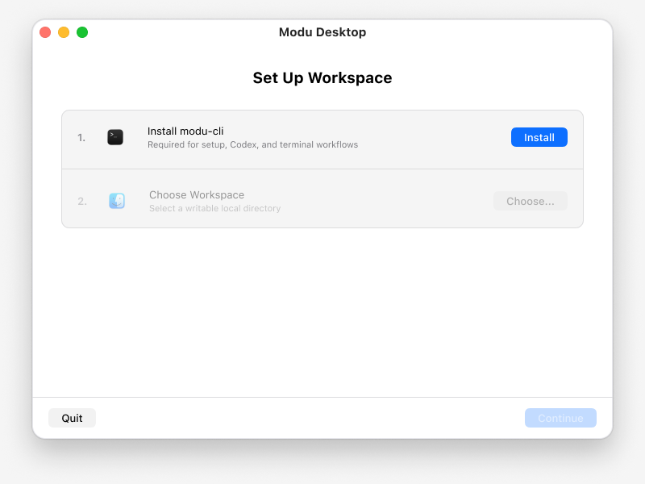

### 8.2 Onboarding - 2

CLI 显示 `Installed`，工作区选择启用；底部次级按钮为 `Quit`。

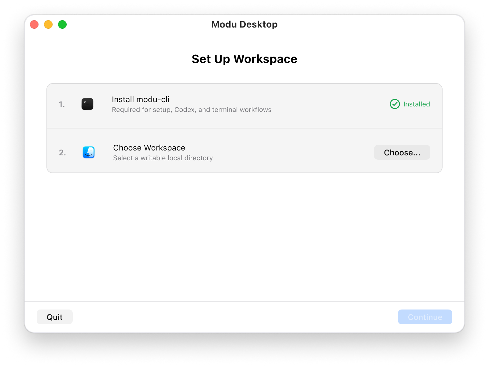

### 8.3 Onboarding - 3

显示 `Selected: <path>`，Continue 启用；点击后先执行无副作用检查；底部次级按钮为 `Quit`。

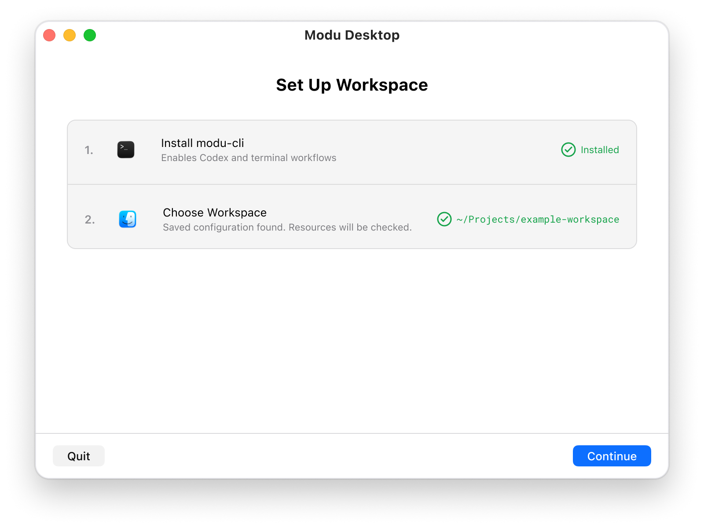

### 8.4 Parse Config Error

代表 `.modu.yaml` 缺失、不可读或无法解析等关键工作区状态加载失败；启动与运行期间复用同一阻断 Alert，提供 Reload、Quit、Choose Another。

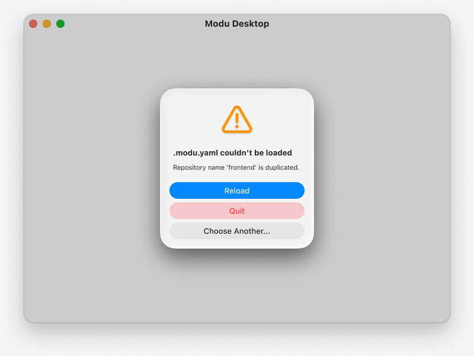

### 8.5 Unselected State

右侧居中显示 `Let's start`；其下先显示以工作区根为目标的 `Codex` 分裂按钮，再显示并排的 `Add Repository` 与 `Create Worktree Group` 白底细边框次级按钮。工作区没有仓库时，`Create Worktree Group` 保持显示但禁用。

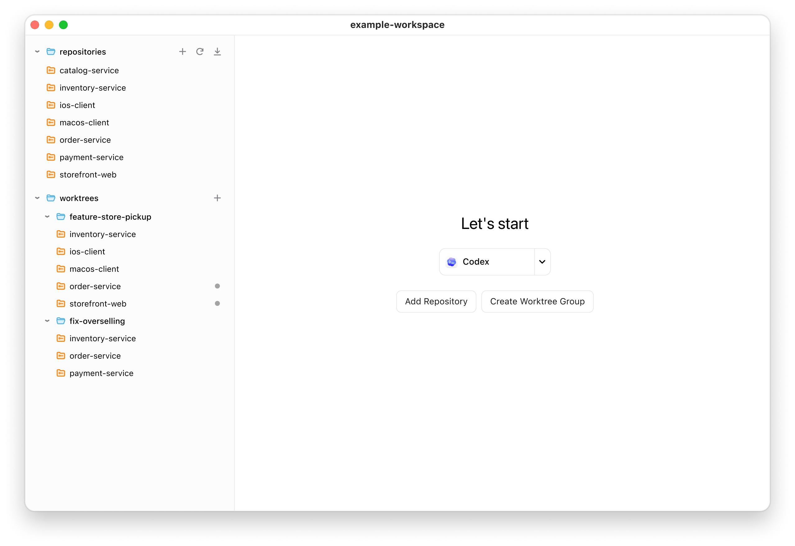

### 8.6 Add Repository

两个 36px 表单行与紧凑 `Add`，不展示派生信息。

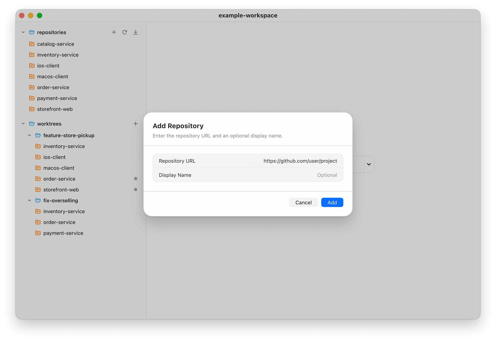

### 8.7 Delete Repository

原生 Sheet 与 28px cleanup 计划行；显示路径与简洁的 Working Tree 状态，确认按钮统一为 `Delete`，不要求显示更详细的风险提示。

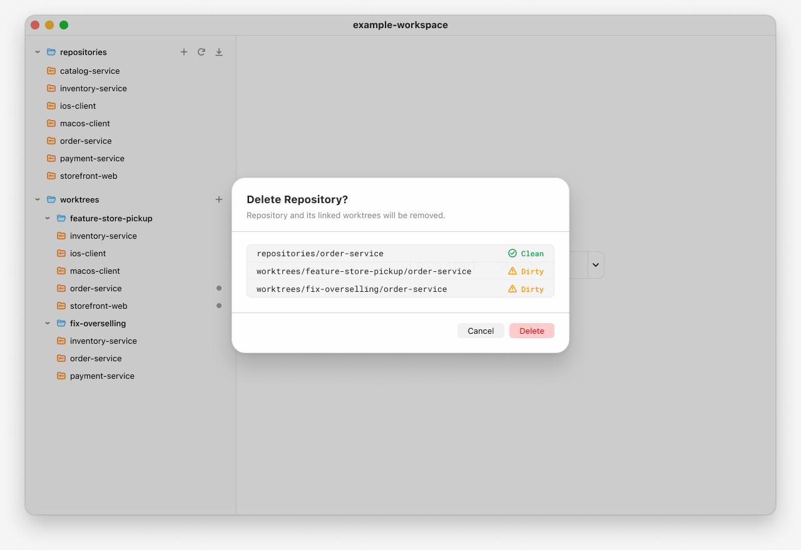

### 8.8 Create Worktree Group

36px Group Name 与仓库 checkbox 列表；按第 1.5 节展示 `catalog-service`、`inventory-service`、`ios-client`、`macos-client`、`order-service`、`payment-service`、`storefront-web`，勾选 `order-service` 与 `storefront-web`，标题右侧为 `2 / 7 selected`。

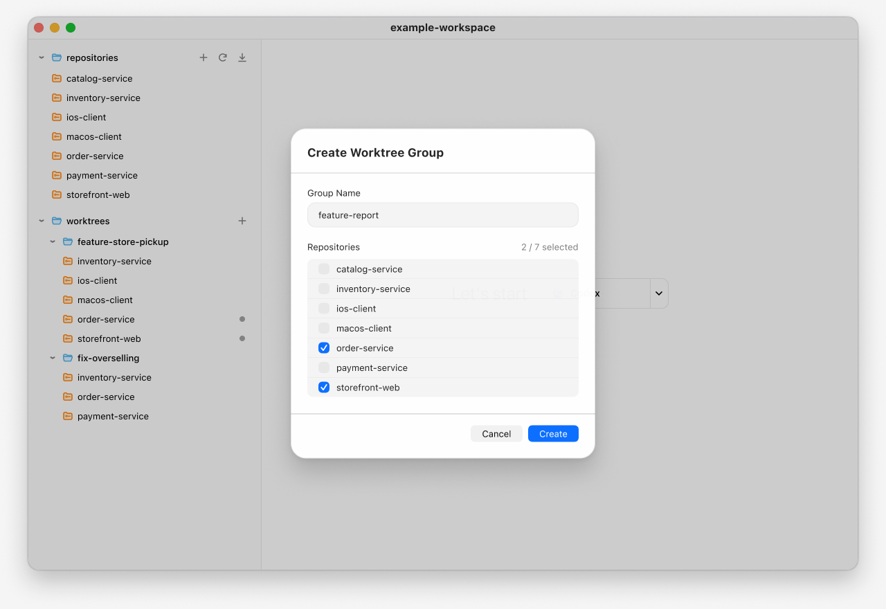

### 8.9 Edit Worktree Group

只读 Group Name 为 `feature-store-pickup`；仓库按第 1.5 节展示，目标成员为除 `catalog-service` 外的 6 个仓库，标题右侧为 `6 / 7 selected`。保存前状态为：`storefront-web`、`order-service` 为 `Dirty`，`ios-client`、`macos-client`、`inventory-service` 为 `Clean`，`catalog-service`、`payment-service` 为 `Unset`。`Other` 仅在真实状态无法读取或分类时出现。该场景只包含 additions，因此按钮为普通 `Save Changes`；存在 removal 时按第 4.3 节采用 destructive 样式。

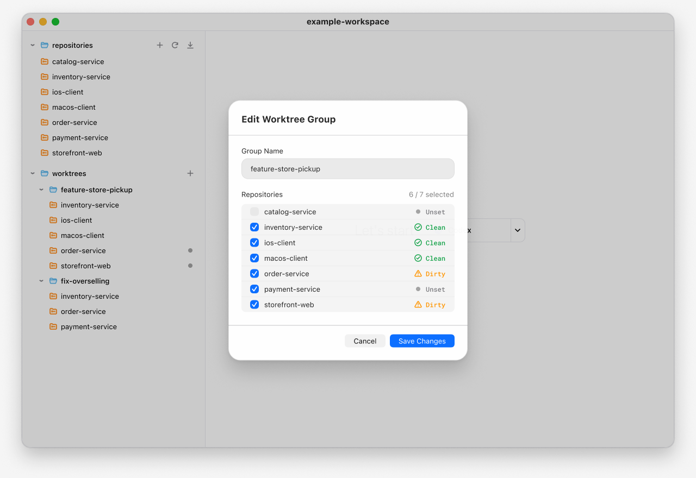

### 8.10 Delete Worktree Group

标题固定为 `Delete Worktree Group?`。列表首行展示 Group 相对路径 `worktrees/feature-store-pickup`，后续列出受影响 worktree 路径与简洁的 Working Tree 状态；不要求显示更详细的风险提示，确认按钮统一为 `Delete`。

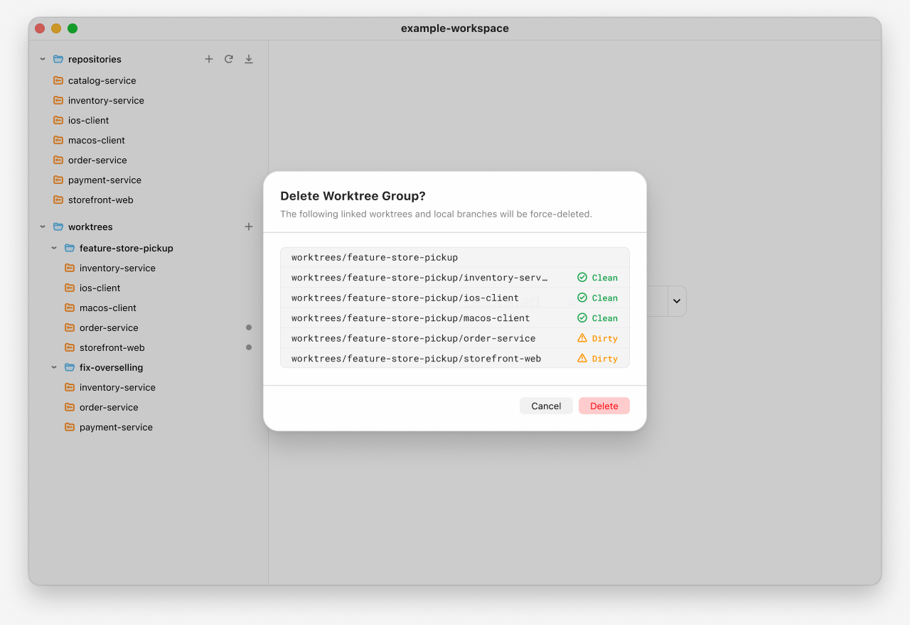

### 8.11 Delete Linked Worktree

展示目标 worktree 路径与简洁的 Working Tree 状态；不要求显示更详细的风险提示，确认按钮统一为 `Delete`。

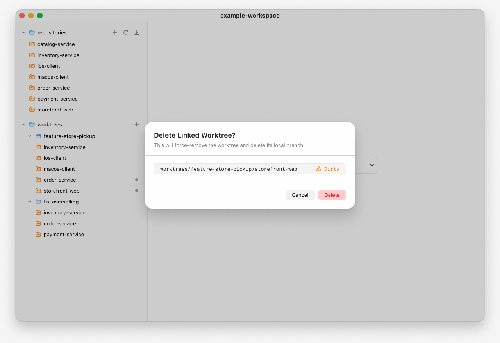

### 8.12 Repository Selected

四类工具与摘要；路径为 `repositories/order-service`，Base branch 示例为 `origin/main`，摘要只显示 Path、Base branch 和 Head branch，不显示 Status 计数。不存在 `Base..HEAD` 差异提交时隐藏 Commits；Changes 仅在存在相对 Base 的文件差异时显示。

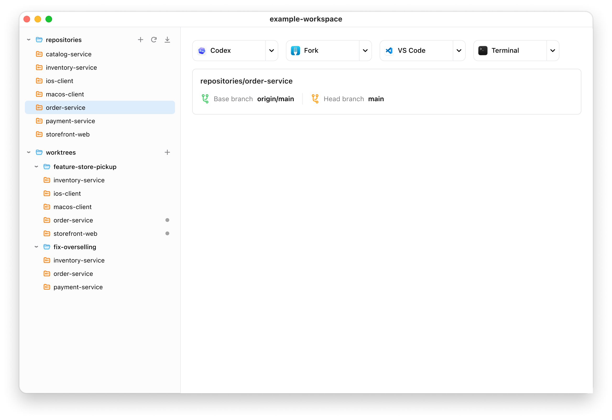

### 8.13 Fetch Running

repositories 操作统一禁用，workspace title 显示 spinner 与 `Fetch 'origin'`。

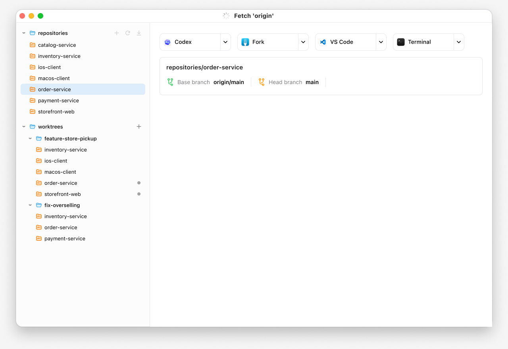

### 8.14 Pull Result Issues

workspace title 已恢复；原生 Alert 只按 `order-service`、`storefront-web` 列出 failed/skipped 状态，不显示简短原因，底部为 `Done`。

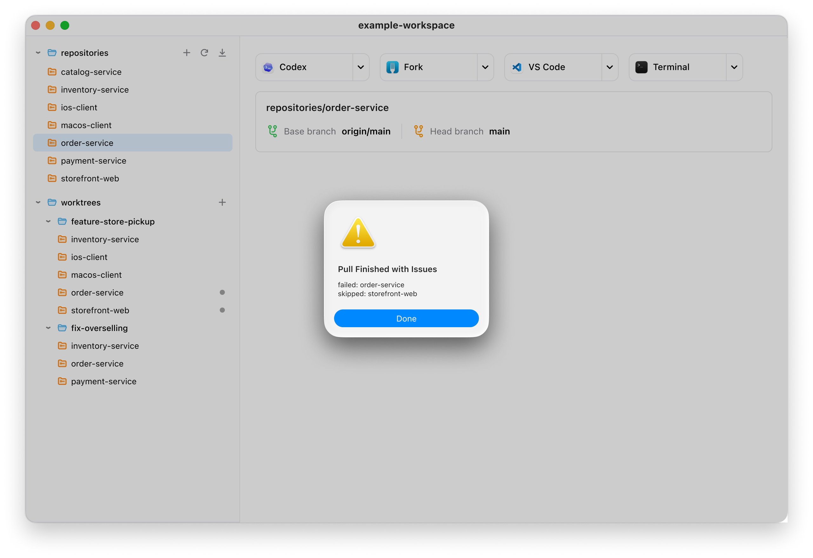

### 8.15 Linked Worktree Selected

路径为 `worktrees/feature-store-pickup/order-service`；Base branch 示例为 `origin/main`，摘要只显示 Path、Base branch 和 Head branch。Changes 展示当前工作树相对 Base 的差异文件，Commits 展示 `Base..HEAD` 的差异提交；`internal/order` 下按 `application`、`domain`、`infrastructure`、`interfaces` 排列并保留各自子树。

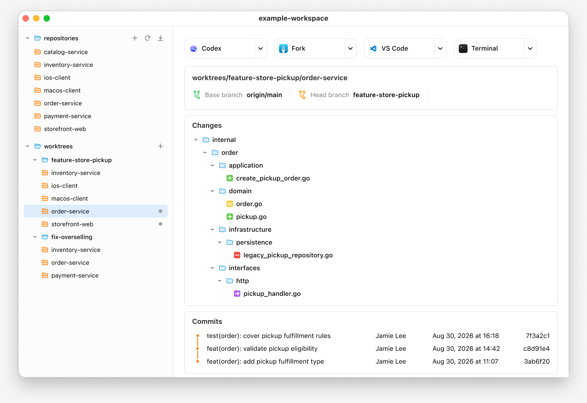

### 8.16 Linked Worktree Context Menu

Context Menu 原型展示 `Copy Path`、`Reveal in Finder`、`Delete Linked Worktree`；其他节点复用该视觉并按第 2.5 节配置菜单项。

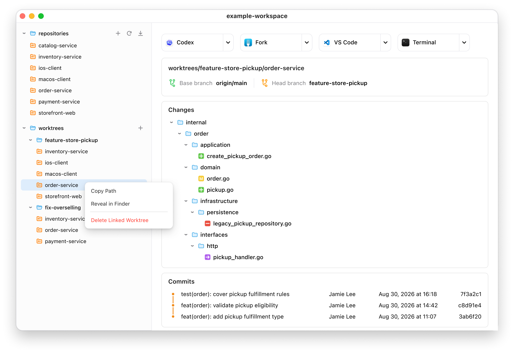

### 8.17 Split Menu Open

原生 Agent menu 展示检测成功的 Codex 与 Claude Code，不显示 check 或持久选中态。

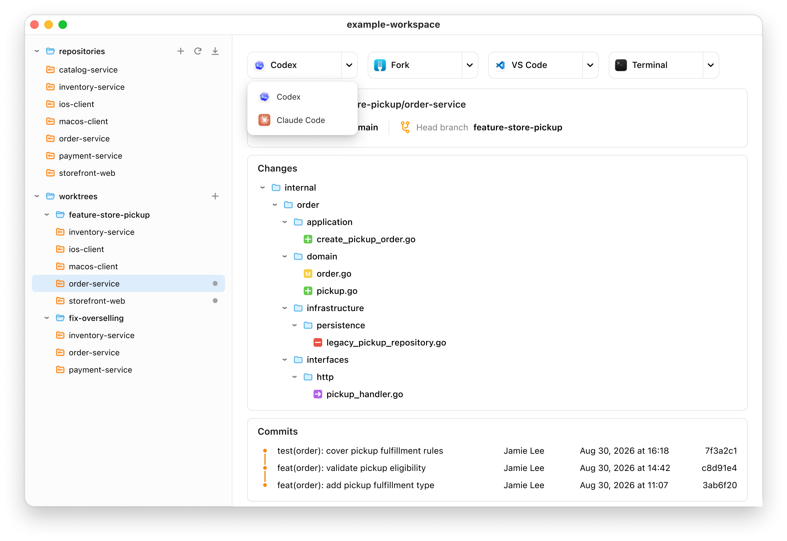

### 8.18 Small Window — Linked Worktree Selected

900×600 最小主窗口中的 linked worktree 选中态。侧栏使用 240px 紧凑宽度，按原生 Outline 槽位保留 Group 与 linked worktree 层级缩进及标题操作；四类工具入口保持可用，divider 与下拉命中区边界对齐。Base branch 示例为 `origin/main`，摘要只显示 Path、Base branch 和 Head branch，固定为 88px。Changes 与 Commits 均溢出，按第 2.2 节分配为 191px 与 156px，使用 52px 紧凑标题结构，对应内容视口为 139px 与 104px。Changes 示例滚动到中部（`scrollOffset≈112px`，总可滚动范围约 225px），视口顶部显示 1px 分隔线和 40px 顶部渐隐，底部继续显示 40px 渐隐；其 overlay indicator 使用 `Page Height=x4 / Position=Middle`。Commits 保持顶部滚动状态，使用 `Page Height=x2 / Position=Top`，包含 5 条 `Base..HEAD` 差异提交，使用 28px 行高与 12px 列间距。侧栏仅以渐隐示意后续内容，详情外层不显示 indicator。

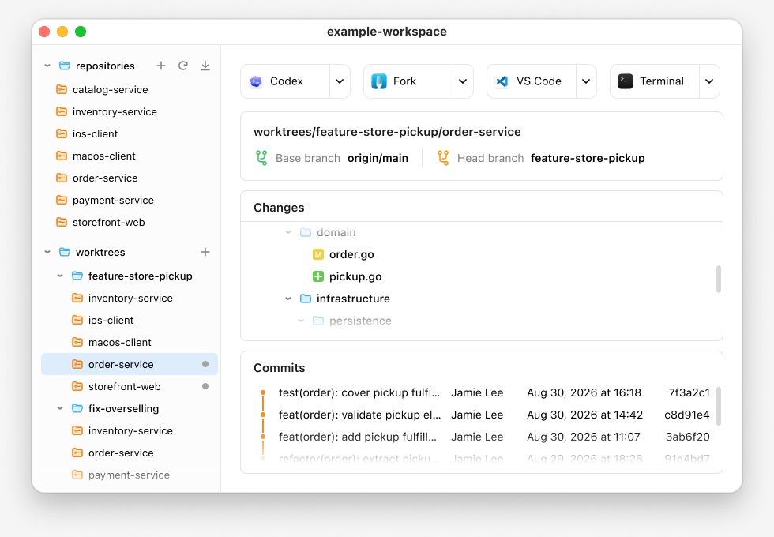

## 9. 必须实现但未单独出图

- 空工作区和空 `worktrees`。
- CLI 安装冲突、失败、PATH 说明与重试。
- clone 中、取消、失败、遗留 staging 和目标冲突。
- 运行中的 `.modu.yaml` 阻断 Alert 与 `.modu-worktrees.yaml` Stale 状态。
- 自动 Fetch 非模态失败、切换/退出取消和全部成功暂态。
- Group 创建/编辑部分失败，removal 时 destructive Save Changes。
- 无提交、Base 缺失、Git 读取失败和 merge/rebase 未完成。
- linked worktree/Group/repository 删除中、风险变化、分支删除失败和 Retry Failed。

这些状态复用既有 Window、Sheet、Alert、Menu、Group Box 和密度体系，不新增卡片式容器或导航层级。
